# 📖 Guía de Instalación y Despliegue: Complemento de Outlook (Add-in dTS CRM)

> Este manual describe cómo instalar, desplegar y utilizar el complemento oficial de **dTS Instruments CRM** en Microsoft Outlook (Web, Windows y Mac).

---

## 📑 Índice
1. [Descripción General y Arquitectura](#1-descripción-general-y-arquitectura)
2. [Método 1: Instalación Rápida Individual (Sideloading / Modo Pruebas)](#2-método-1-instalación-rápida-individual-sideloading--modo-pruebas)
3. [Método 2: Despliegue Centralizado en Microsoft 365 (Recomendado para la Empresa)](#3-método-2-despliegue-centralizado-en-microsoft-365-recomendado-para-la-empresa)
4. [Guía de Uso para el Comercial](#4-guía-de-uso-para-el-comercial)
5. [Resolución de Dudas Frecuentes (FAQ)](#5-resolución-de-dudas-frecuentes-faq)

---

## 1. Descripción General y Arquitectura

El **Add-in dTS CRM** añade un botón oficial `"Registrar en dTS CRM"` directamente en la barra de herramientas superior (Ribbon) de Microsoft Outlook.

```mermaid
flowchart LR
    A["📧 Comercial leyendo correo en Outlook"] --> B["🔘 Clic en botón 'Registrar en dTS CRM'"]
    B --> C["📱 Se abre el Panel Lateral dTS CRM"]
    C --> D["🧠 Detecta contacto, cliente y ofertas abiertas"]
    D --> E["💾 Comercial pulsa 'Guardar en dTS CRM'"]
    E --> F["✅ Registrado en Timeline y Oferta al instante"]

    style B fill:#003E51,stroke:#00B0B9,stroke-width:2px,color:#fff
    style C fill:#f8fafc,stroke:#003E51,stroke-width:2px,color:#000
    style E fill:#00B0B9,stroke:#003E51,stroke-width:2px,color:#fff
    style F fill:#10b981,stroke:#059669,stroke-width:2px,color:#fff
```

### Características Principales:
* **Reconocimiento Automático:** Detecta al interlocutor externo (analizando el remitente en correos recibidos o los destinatarios en correos enviados).
* **Vinculación a Ofertas:** Si el cliente tiene cotizaciones abiertas en el pipeline, permite asociar el correo a una oferta específica con un clic.
* **Limpieza Inteligente de RGPD:** Trunca automáticamente cláusulas de privacidad, cadenas de reenvío y firmas pesadas.
* **Control de Duplicados:** Si un correo ya fue registrado, muestra el distintivo verde `✓ Ya registrado en dTS CRM` bloqueando duplicidades.
* **Asociación Directa a Empresa:** Si el remitente no está registrado en los contactos de Business Central, permite vincular el correo directamente al historial de la empresa cliente en el CRM sin bloquear la operativa.

---

## 2. Método 1: Instalación Rápida Individual (Sideloading / Modo Pruebas)

Ideal para probar el complemento en tu propio buzón en menos de 1 minuto sin esperar al administrador de sistemas.

### Pasos en Outlook Web (outlook.office.com):

1. Abre tu navegador e inicia sesión en **[Outlook Web](https://outlook.office.com/)**.
2. Abre cualquier correo electrónico de tu bandeja de entrada.
3. En la esquina superior derecha del correo, haz clic en el icono de **tres puntos (...)** (Más acciones) o en el icono de **Aplicaciones / Complementos** en la barra superior.
4. Selecciona **Obtener complementos** (o *Administrar complementos* / *Add-ins*).
5. En el menú lateral izquierdo de la ventana emergente, pulsa en **Mis complementos**.
6. Desplázate hasta la sección inferior llamada **Complementos personalizados**.
7. Haz clic en **+ Agregar un complemento personalizado** ➔ Selecciona **Agregar desde un archivo...**.
8. Selecciona el archivo [`manifest.xml`](file:///c:/proyectos/webapp_dts/outlook-addin/manifest.xml) de la carpeta `outlook-addin/`.
9. Haz clic en **Instalar**. 
10. ¡Listo! A partir de ese momento, al abrir cualquier correo verás el botón **Registrar en dTS CRM** en tu cinta de opciones.

---

## 3. Método 2: Despliegue Centralizado en Microsoft 365 (Recomendado para la Empresa)

Este método permite al Administrador de Microsoft 365 de dTS Instruments instalar el complemento a todos los comerciales de la empresa **de forma silenciosa y automática**, sin que ningún usuario tenga que configurar nada en su ordenador.

### Pasos para el Administrador de TI:

1. Inicia sesión en el **[Centro de Administración de Microsoft 365](https://admin.microsoft.com/)** con cuenta de administrador global.
2. En el menú de navegación lateral, ve a:  
   **Configuración** ➔ **Aplicaciones integradas** (*Integrated apps*).
3. Haz clic en el botón superior **Implementar aplicación** (*Deploy add-in* o *Get apps*).
4. Elige la opción **Cargar aplicaciones personalizadas** (*Upload custom apps*).
5. En el desplegable, selecciona **Tipo de aplicación: Complemento de Office**.
6. Selecciona la opción **Tengo el archivo de manifiesto (.xml)** y sube el archivo [`manifest.xml`](file:///c:/proyectos/webapp_dts/outlook-addin/manifest.xml).
7. **Asignar Usuarios:**
   * Puedes asignarlo a **Toda la organización** o a un grupo específico (ej. `Equipo Comercial` o `Ventas dTS`).
8. **Método de Implementación:** Selecciona **Fijo (Predeterminado)** para que el complemento aparezca anclado de forma automática en el Outlook de todos los usuarios seleccionados.
9. Pulsa en **Siguiente** y confirma en **Implementar**.
10. Microsoft propagará el complemento a todos los clientes de Outlook (Escritorio, Web y Móvil) en un plazo de entre 1 y 6 horas.

---

## 4. Guía de Uso para el Comercial

### Paso 1: Abrir el panel
Cuando estés leyendo un correo en Outlook de un cliente o proveedor, haz clic en el botón **Registrar en dTS CRM** situado en la barra de herramientas superior.

### Paso 2: Revisar la información detectada
En el panel lateral derecho verás:
* El asunto, remitente y fecha original del mensaje.
* Si el contacto ya existe en dTS, aparecerá con el distintivo verde **✓ Identificado** junto a su empresa.
* Si el remitente no está registrado, dispones de un buscador predictivo para asociar el correo a la empresa cliente correspondiente (los contactos oficiales se crean y sincronizan desde Business Central vía n8n).

### Paso 3: Asignar tipología y oferta (Opcional)
* **Tipología:** Selecciona el botón correspondiente (`📄 Cierre/Aceptación`, `⚙️ Técnica`, `💬 Negociación`, `⚠️ Postventa`, `✉️ General`).
* **Vincular a Oferta:** Si el cliente tiene cotizaciones en curso, selecciónala del menú desplegable para que el correo se registre también en el seguimiento de esa venta.

### Paso 4: Guardar
Haz clic en **[ 💾 Guardar Correo en dTS CRM ]**.  
Aparecerá una confirmación verde inmediata. El correo ya está registrado en el Timeline del contacto y visible para todo el equipo en la WebApp dTS Instruments.

---

## 5. Resolución de Dudas Frecuentes (FAQ)

#### ¿Qué ocurre si registro el correo dos veces por error?
El sistema comprueba el identificador único del correo de Microsoft Graph. Si ya fue registrado, el panel muestra el mensaje `✓ Ya registrado en dTS CRM` y no duplica la entrada en la base de datos.

#### ¿Los demás compañeros pueden ver los correos registrados?
Sí. Al registrar un correo con el Add-in, pasa a formar parte del historial comercial del cliente en el CRM. Cualquier usuario con permisos comerciales en la WebApp podrá consultar el extracto del correo y, si tiene permisos en Microsoft 365, abrirlo directamente en Outlook con el botón *"Abrir en Outlook"*.

#### ¿Funciona en la aplicación de escritorio de Outlook para Windows?
Sí. El complemento es un Add-in web universal compatible con el nuevo Outlook para Windows, Outlook clásico, Outlook para Mac y Outlook en la web (navegador).
