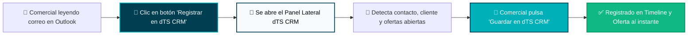

# 📖 Guía de Instalación y Despliegue: Complemento de Outlook (Add-in dTS CRM)

> Este manual describe la instalación del Add-in de Office para registrar correos y, en la sección 7, el componente Windows para abrirlos desde el CRM en Outlook Classic. Son instalaciones independientes.

---

## 📑 Índice
1. [Descripción General y Arquitectura](#1-descripción-general-y-arquitectura)
2. [Método 1: Instalación Rápida Individual (Sideloading / Modo Pruebas)](#2-método-1-instalación-rápida-individual-sideloading--modo-pruebas)
3. [Método 2: Despliegue Centralizado en Microsoft 365 (Recomendado para la Empresa)](#3-método-2-despliegue-centralizado-en-microsoft-365-recomendado-para-la-empresa)
4. [Guía de Uso para el Comercial](#4-guía-de-uso-para-el-comercial)
5. [Resolución de Dudas Frecuentes (FAQ)](#5-resolución-de-dudas-frecuentes-faq)

---

[Ir a instalación de Outlook Classic, sección 7](#7-instalador-interno-para-abrir-correos-en-outlook-classic).

## 1. Descripción General y Arquitectura

El **Add-in dTS CRM** añade un botón oficial `"Registrar en dTS CRM"` directamente en la barra de herramientas superior (Ribbon) de Microsoft Outlook.

```mermaid
flowchart LR
    A["📧 Comercial leyendo correo en Outlook"] --> B["🔘 Clic en botón 'Registrar en dTS CRM'"]
    B --> C["📱 Se abre el Panel Lateral dTS CRM"]
    C --> D["🧠 Detecta contacto, cliente y ofertas abiertas"]
    D --> E["💾 Comercial pulsa 'Guardar en dTS CRM'"]
    E --> F["✅ Registrado en Timeline y Oferta al instante"]

    style B fill:#003E51,stroke:#00B0B9,stroke-width:2px,color:#fff
    style C fill:#f8fafc,stroke:#003E51,stroke-width:2px,color:#000
    style E fill:#00B0B9,stroke:#003E51,stroke-width:2px,color:#fff
    style F fill:#10b981,stroke:#059669,stroke-width:2px,color:#fff
```

### Características Principales:
* **Reconocimiento Automático:** Detecta al interlocutor externo (analizando el remitente en correos recibidos o los destinatarios en correos enviados).
* **Vinculación a Ofertas:** Si el cliente tiene cotizaciones abiertas en el pipeline, permite asociar el correo a una oferta específica con un clic.
* **Limpieza Inteligente de RGPD:** Trunca automáticamente cláusulas de privacidad, cadenas de reenvío y firmas pesadas.
* **Control de Duplicados:** Si un correo ya fue registrado, muestra el distintivo verde `✓ Ya registrado en dTS CRM` bloqueando duplicidades.
* **Asociación Directa a Empresa:** Si el remitente no está registrado en los contactos de Business Central, permite vincular el correo directamente al historial de la empresa cliente en el CRM sin bloquear la operativa.

---

## 2. Método 1: Instalación Rápida Individual (Sideloading / Modo Pruebas)

Ideal para probar el complemento en tu propio buzón en menos de 1 minuto sin esperar al administrador de sistemas.

### Pasos en Outlook Web (outlook.office.com):

1. Abre tu navegador e inicia sesión en **[Outlook Web](https://outlook.office.com/)**.
2. Abre cualquier correo electrónico de tu bandeja de entrada.
3. En la esquina superior derecha del correo, haz clic en el icono de **tres puntos (...)** (Más acciones) o en el icono de **Aplicaciones / Complementos** en la barra superior.
4. Selecciona **Obtener complementos** (o *Administrar complementos* / *Add-ins*).
5. En el menú lateral izquierdo de la ventana emergente, pulsa en **Mis complementos**.
6. Desplázate hasta la sección inferior llamada **Complementos personalizados**.
7. Haz clic en **+ Agregar un complemento personalizado** ➔ Selecciona **Agregar desde un archivo...**.
8. Selecciona el archivo [`manifest.xml`](file:///c:/proyectos/webapp_dts/outlook-addin/manifest.xml) de la carpeta `outlook-addin/`.
9. Haz clic en **Instalar**. 
10. ¡Listo! A partir de ese momento, al abrir cualquier correo verás el botón **Registrar en dTS CRM** en tu cinta de opciones.

---

## 3. Método 2: Despliegue Centralizado en Microsoft 365 (Recomendado para la Empresa)

Este método permite al Administrador de Microsoft 365 de dTS Instruments instalar el complemento a todos los comerciales de la empresa **de forma silenciosa y automática**, sin que ningún usuario tenga que configurar nada en su ordenador.

### Pasos para el Administrador de TI:

1. Inicia sesión en el **[Centro de Administración de Microsoft 365](https://admin.microsoft.com/)** con cuenta de administrador global.
2. En el menú de navegación lateral, ve a:  
   **Configuración** ➔ **Aplicaciones integradas** (*Integrated apps*).
3. Haz clic en el botón superior **Implementar aplicación** (*Deploy add-in* o *Get apps*).
4. Elige la opción **Cargar aplicaciones personalizadas** (*Upload custom apps*).
5. En el desplegable, selecciona **Tipo de aplicación: Complemento de Office**.
6. Selecciona la opción **Tengo el archivo de manifiesto (.xml)** y sube el archivo [`manifest.xml`](file:///c:/proyectos/webapp_dts/outlook-addin/manifest.xml).
7. **Asignar Usuarios:**
   * Puedes asignarlo a **Toda la organización** o a un grupo específico (ej. `Equipo Comercial` o `Ventas dTS`).
8. **Método de Implementación:** Selecciona **Fijo (Predeterminado)** para que el complemento aparezca anclado de forma automática en el Outlook de todos los usuarios seleccionados.
9. Pulsa en **Siguiente** y confirma en **Implementar**.
10. Microsoft propagará el complemento a todos los clientes de Outlook (Escritorio, Web y Móvil) en un plazo de entre 1 y 6 horas.

---

## 4. Guía de Uso para el Comercial

### Paso 1: Abrir el panel
Cuando estés leyendo un correo en Outlook de un cliente o proveedor, haz clic en el botón **Registrar en dTS CRM** situado en la barra de herramientas superior.

### Paso 2: Revisar la información detectada
En el panel lateral derecho verás:
* El asunto, remitente y fecha original del mensaje. Los campos **De:** y **Para:** muestran directamente las direcciones de correo electrónico de cada interlocutor de forma limpia y legible.
* Por defecto, la opción de vinculación a oferta permanece en **`(Sin vincular a oferta - Solo ficha cliente)`**, permitiendo al comercial asociar una cotización solo cuando sea pertinente.
* Mientras se consulta la base de datos, el panel muestra un **Skeleton Loader** estructurado con animación suave corporativa, garantizando una percepción de carga instantánea sin pantallas en blanco ni esperas bloqueantes.
* Si el contacto ya existe en dTS, aparecerá con el distintivo verde **✓ Identificado** junto a su empresa.
* Si el remitente no está registrado, dispones de un buscador predictivo para asociar el correo a la empresa cliente correspondiente (los contactos oficiales se crean y sincronizan desde Business Central vía n8n).

### Paso 3: Asignar tipología y oferta (Opcional)
* **Tipología:** Selecciona el botón correspondiente (`📋 Petición oferta`, `📦 Oferta proveedor`, `📝 Revisión oferta`, `💬 Negociación`, `📄 Cierre/Aceptación`).
* **Vincular a Oferta:** Si el cliente tiene cotizaciones en curso y deseas vincular el correo a una de ellas, elígela del menú desplegable. De lo contrario, déjalo en la opción predeterminada para registrarlo exclusivamente en la ficha general del cliente.

### Paso 4: Guardar
Haz clic en **[ 💾 Guardar Correo en dTS CRM ]**.  
Aparecerá una confirmación verde inmediata. El correo queda registrado en el Timeline del contacto, consultable por los usuarios con permisos y cartera autorizados.

---

## 5. Resolución de Dudas Frecuentes (FAQ)

#### ¿Qué ocurre si registro el correo dos veces por error?
El sistema comprueba el identificador único del correo de Microsoft Graph. Si ya fue registrado, el panel muestra el mensaje `✓ Ya registrado en dTS CRM` y no duplica la entrada en la base de datos.

#### ¿Los demás compañeros pueden ver los correos registrados?
La consulta del extracto depende de los permisos y la cartera autorizada del CRM. En el piloto de apertura exacta solo se abre el mensaje del buzón Microsoft 365 del usuario autenticado; Admin y Dirección no obtienen acceso a buzones privados ajenos.

#### ¿Funciona en la aplicación de escritorio de Outlook para Windows?
Sí. El complemento es un Add-in web universal compatible con el nuevo Outlook para Windows, Outlook clásico, Outlook para Mac y Outlook en la web (navegador).

#### ¿Qué hacer si aparece un error de consentimiento o token caducado (`AADSTS65001 / consent_required`)?
Este mensaje indica que Microsoft requiere una confirmación interactiva de permisos para la aplicación `dTS CRM - Exchange Sync`:
1. **Solución rápida para el comercial:** Entra a la WebApp en **CRM** o **Ajustes** (`/settings`), pulsa en **"Reconectar con Microsoft 365"**, inicia sesión y pulsa **Aceptar** en la pantalla de permisos.
2. **Solución definitiva para la empresa (Administrador de TI):** Accede al [Portal de Microsoft Entra / Azure](https://entra.microsoft.com/) ➔ *Aplicaciones* ➔ *Registros de aplicaciones* ➔ `dTS CRM - Exchange Sync` ➔ *Permisos de API* y haz clic en **"Conceder consentimiento de administrador para dTS Instruments"**. De este modo, ningún empleado volverá a requerir confirmación individual.

## 7. Instalador interno para abrir correos en Outlook Classic

### 7.1 Requisitos y estado

- Windows con Outlook **Classic** instalado y el buzón corporativo configurado. El nuevo Outlook no utiliza este componente COM.
- Cuenta Microsoft 365 conectada al CRM, permisos de acceso y habilitación del piloto.
- Backend y frontend actualizados; la opción Classic debe estar habilitada por el responsable de la aplicación.
- Las tablas de Classic ya están creadas en Supabase y comprobadas a 15/10/2026. La instalación y la prueba completa en producción siguen pendientes de confirmación.

No es necesario cambiar el manifiesto del Add-in ni adquirir un certificado para este instalador interno. La conexión Microsoft 365 de la app y la vinculación del equipo son dos pasos distintos.

### 7.2 Instalación por usuario

1. En el CRM, abre `/outlook-classic`. Si tu cuenta está habilitada y el paquete está desplegado, pulsa **Descargar instalador de Outlook Classic**. El administrador también puede facilitar el mismo ZIP generado en el proyecto.
2. Extrae **todo** `OutlookClassic.zip` en una carpeta. Conserva el ejecutable junto a los BAT; copiar solo el BAT no basta.
3. Ejecuta `Instalar_Outlook_dTS.bat` con tu usuario habitual de Windows, **sin ejecutar como administrador**.
4. El componente se copia al perfil local y registra el protocolo de apertura. A continuación muestra un código y abre el CRM para vincular el equipo.
5. Inicia sesión con tu cuenta del CRM e introduce el código que ves en la ventana del componente. Pulsa **Vincular este equipo a mi cuenta**.
6. Vuelve a la ventana Windows y pulsa **Ya he confirmado en el CRM**. La vinculación caduca en cinco minutos; si ha vencido, inicia una nueva.
7. Desde Emails o Timeline, prueba **Abrir en Outlook Classic** y comprueba el mensaje. Si el navegador solicita abrir la aplicación, acepta para completar esa apertura.

El componente se instala en `%LOCALAPPDATA%\dTS\OutlookClassic\1.0.0` y el protocolo se registra en HKCU. No modifica el manejador antiguo `dts-mail`; la nueva apertura usa `dts-outlook`. La clave del equipo queda cifrada para el usuario Windows.

### 7.3 Distribución interna sin certificado

El paquete se distribuye sin firma Authenticode por decisión de la empresa. Windows puede mostrar un aviso de editor desconocido o aplicar una política que impida ejecutarlo. El instalador no modifica políticas, antivirus ni certificados. Si el equipo lo bloquea, contacta con el responsable informático.

Las comprobaciones de identidad y las firmas criptográficas de las solicitudes del equipo se mantienen. La falta de certificado del ejecutable no elimina la vinculación ni el control de acceso.

### 7.4 Actualización, nueva vinculación y retirada

| Acción | Procedimiento |
| --- | --- |
| Actualizar la versión | Cierra el componente, extrae el ZIP facilitado y ejecuta el BAT de instalación. La vinculación existente se conserva si su clave local sigue disponible. |
| Volver a vincular | Ejecuta `Vincular_Outlook_dTS.bat` y repite la confirmación del código con tu cuenta. Si sustituyes una vinculación, revoca después la entrada anterior que ya no utilices. |
| Retirar del equipo | Ejecuta `Desinstalar_Outlook_dTS.bat` con el mismo usuario Windows y revoca el equipo en **Mis equipos** del CRM. Los ejecutables bloqueados pueden requerir limpieza posterior. |
| Retirar acceso sin disponer del equipo | En `/outlook-classic`, revoca su vinculación. La revocación impide nuevas solicitudes para ese dispositivo. |

### 7.5 Incidencias de apertura

| Mensaje o situación | Qué revisar |
| --- | --- |
| Classic no habilitado | El administrador debe revisar el piloto, permisos y despliegue. Instalar el BAT por sí solo no habilita la cuenta. |
| El instalador no está publicado | Falta desplegar el frontend que contiene el ZIP y sus metadatos. |
| Código incorrecto o caducado | Inicia una nueva vinculación y utiliza únicamente el código de la ventana de tu equipo. |
| El navegador no abre la aplicación | Comprueba instalación con tu usuario Windows y autorización del navegador. Descargar el ZIP no instala el protocolo. |
| Apertura sin confirmar | Revisa si Outlook ya mostró el mensaje antes de repetir; puedes elegir la alternativa Web. |
| Buzón no disponible o identidad distinta | Verifica que Classic tenga configurada la misma cuenta conectada al CRM. No se abre otro correo como sustituto. |
| Mensaje movido a PST, archivo en línea u otro buzón | Fuera de la cobertura aceptada de esta entrega; solicita revisión. Un movimiento entre carpetas del mismo buzón sí forma parte de las pruebas. |

La prueba de aceptación consiste en abrir el mismo mensaje desde Emails y Timeline, moverlo a otra carpeta del mismo buzón y repetir, además de probar Classic cerrado. Registrar los resultados antes de extender el piloto al equipo.

Administración: [activación, tablas y controles técnicos](propuestas/2026-10-15-fase-4-apertura-exacta-classic.md).

### Validación de apertura comunicada el 16/10/2026

El usuario confirma equipo vinculado y apertura correcta de correos enviados y recibidos, también después de mover el mensaje entre carpetas del mismo buzón. Este resultado actualiza el estado pendiente indicado en la entrega inicial del 15/10. No acredita todavía arranque con Classic cerrado, revocación o perfiles con varias cuentas. La siguiente fase revisa referencias antiguas y acciones compartidas; se mantiene el manejador heredado hasta completar su sustitución.

## 8. Si Outlook Web no puede iniciar el complemento

Cuando Outlook Web muestra «algo ha salido mal y no se puede iniciar este complemento» antes del panel CRM, debe revisarse la carga del propio Add-in. No se soluciona reinstalando el BAT de Classic ni repitiendo el SQL.

La corrección del 16/10/2026 inicia Office antes de pedir acceso al CRM, para admitir la sesión aislada del panel Web. Requiere desplegar el frontend actualizado; no cambia el manifiesto y no exige actualizarlo en Microsoft 365 por este ajuste. Después del despliegue, cerrar el panel, recargar Outlook Web y volver a abrir el complemento desde un correo. Si aparece el formulario de acceso CRM, iniciar sesión allí aunque la aplicación principal ya tenga sesión.

Si persiste el error, distinguir si aparece antes del formulario o dentro del panel, anotar el nombre del complemento y revisar conectividad a Office.js y errores del navegador. La prueba de arranque automatizada no sustituye esta validación real en Outlook Web.
