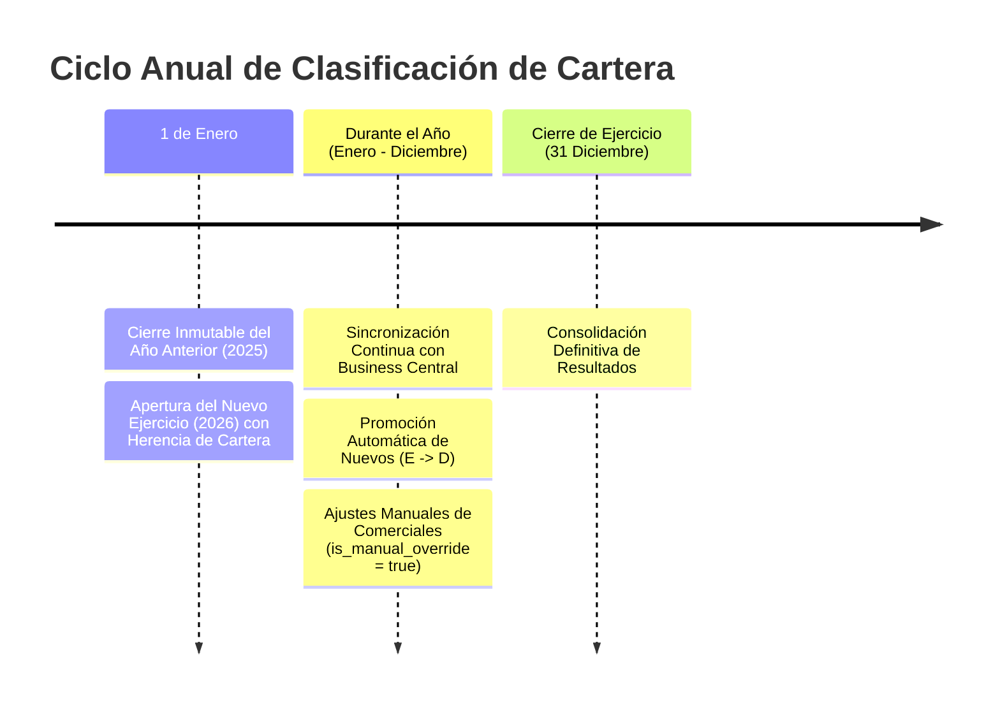
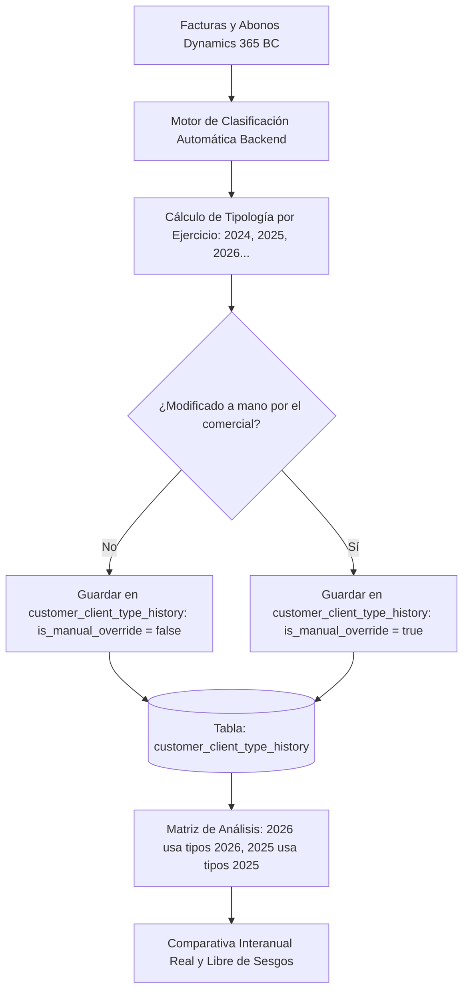

# 📄 Propuesta Técnica y Funcional: Automatización de la Clasificación de Clientes por Tipo de Relación (CRM)

**Fecha:** 8 de Septiembre de 2026  
**Proyecto:** dTS Instruments WebApp  
**Módulo:** CRM > Clientes & Matriz de Relación  
**Autor:** Antigravity AI / dTS Instruments Engineering  
**Estado:** Propuesta en Revisión  

---

## 1. Contexto y Diagnóstico del Problema

### 1.1. Situación Actual
Actualmente, la tipología de relación del cliente (**Tipos A a F**) se almacena como un único campo estático en la tabla de clientes (`customers.client_type`):
* **A:** Clientes Leales o Fieles
* **B:** Habituales / Frecuentes
* **C:** Clientes Ocasionales
* **D:** Clientes Nuevos
* **E:** Potenciales
* **F:** Inactivos

En la nueva **Matriz de Análisis por Tipo de Relación**, se calcula la facturación del año actual (ej. 2026 YTD) y se compara con el año anterior (2025 LYTD).

### 1.2. El Problema Detectado
Al existir únicamente la tipología actual asignada a mano:
> **Se produce un sesgo analítico de cohorte actual:**  
> Un cliente que en 2025 facturó poco (era *Ocasional - C*) pero que en 2026 ha crecido fuertemente y ha sido catalogado como *Leal - A*, suma sus ventas de 2025 en la fila **A**.  
> Inversamente, un cliente que en 2025 era una gran cuenta (*Leal - A*) pero que en 2026 ha dejado de comprar y ahora es clasificado como *Inactivo - F*, suma sus ventas históricas de 2025 en la fila **F**.

**Conclusión:** La comparativa con años anteriores no refleja la composición real de la cartera en cada ejercicio, sino la evolución retrospectiva de las empresas que hoy ostentan esa etiqueta.

---

## 2. Opciones de Clasificación Automática Basadas en Facturación

Para solucionar esta limitación y que el sistema pueda reconstruir la realidad de **cada ejercicio (2024, 2025, 2026...)**, se plantean 3 modelos algorítmicos alimentados directamente por los datos contables de Business Central (`value_entries` / facturas y abonos).

En todos los modelos, existen **tres reglas universales e indiscutibles** ligadas al ciclo de vida del cliente:

1. **D · Clientes Nuevos:** Su **primera factura histórica** en dTS se emite en el año analizado $T$ (`Ventas(T) > 0` y `Ventas(años anteriores) == 0`).
2. **E · Potenciales:** Clientes registrados (con contactos o presupuestos/ofertas), pero con **cero facturación en toda la historia** (`Ventas Totales == 0`).
3. **F · Inactivos:** Clientes que facturaron en el pasado (`Ventas(años anteriores) > 0`), pero que en el año analizado $T$ tienen **cero facturación** (`Ventas(T) == 0`).

La diferenciación entre los modelos radica en cómo clasificar automáticamente las cuentas que sí han comprado en el año $T$ entre **A (Leales)**, **B (Habituales)** y **C (Ocasionales)**:

---

### 🟢 Opción 1: Modelo por Ciclo de Vida y Umbrales Monetarios de Facturación (Recomendada B2B)

Este modelo combina la **recurrencia entre años** con **umbrales absolutos de facturación** acordes al perfil industrial de dTS Instruments.

Para cualquier año analizado $T$:

| Tipo de Cliente | Criterio Matemático | Justificación de Negocio |
|---|---|---|
| **A · Leales / Fieles** | `Ventas(T) >= 25.000 €` <br> **Y** `Ventas(T-1) > 0` *(compró también el año anterior)* | Cuentas estratégicas de gran volumen que mantienen relación continuada año tras año. |
| **B · Habituales** | `Ventas(T) entre 5.000 € y 25.000 €` <br> **Y** `Ventas(T-1) > 0` | Clientes recurrentes de tamaño medio que forman la columna vertebral del negocio. |
| **C · Ocasionales** | `Ventas(T) < 5.000 €` <br> **O** `Ventas(T-1) == 0` *(compró en T pero no en T-1)* | Compras esporádicas, pequeñas reposiciones o clientes reactivados tras un periodo de inactividad. |
| **D · Nuevos** | Primera compra histórica en el año $T$. | Captación neta del ejercicio. |
| **E · Potenciales** | Histórico de facturación = 0 €. | Cuentas en prospección. |
| **F · Inactivos** | Compró antes de $T$, pero en $T$ facturó 0 €. | Cuentas en riesgo de pérdida o baja. |

* **Ventajas:** Es el modelo más fácil de comprender por el equipo de ventas. Se adapta perfectamente al ticket medio de instrumentación.
* **Calibración:** Los importes (25.000 € y 5.000 €) son configurables en el sistema.

---

### 🔵 Opción 2: Modelo Pareto Puro (70% / 20% / 10% Relativo al Ejercicio)

En lugar de fijar cantidades en euros (que pueden verse afectadas por la inflación o la evolución del mercado), este modelo clasifica a los clientes según su **peso relativo en la facturación total** de ese año específico:

1. Se ordenan todos los clientes con facturación en el año $T$ de mayor a menor importe.
2. Se calcula el porcentaje acumulado de facturación:
   * **A · Leales (Top 70%):** El grupo selecto de clientes que generan el **primer 70% de la facturación** (habitualmente representa el 10% - 15% de las cuentas).
   * **B · Habituales (Siguiente 20%):** Clientes que aportan entre el **70% y el 90%** de la facturación acumulada.
   * **C · Ocasionales (Último 10%):** El resto de clientes que conforman la "cola larga" de pequeñas operaciones (aportan del 90% al 100%).
3. Los tipos **D**, **E** y **F** mantienen sus reglas de ciclo de vida.

* **Ventajas:** No requiere definir importes fijos. Funciona igual de bien para 2023, 2024, 2025 o 2026 de forma 100% matemática y homogénea.
* **Inconveniente:** Un cliente con 20.000 € podría ser A en un año flojo y B en un año de ventas récord.

---

### 🟣 Opción 3: Modelo RFM Adaptado a B2B Industrial (Recency, Frequency, Monetary)

El estándar analítico de CRM basado en tres variables objetivas:

1. **Frecuencia (F):** ¿En cuántos de los últimos 3 años ha comprado?
   * *3 de 3 años:* Máxima recurrencia $\rightarrow$ Apto para **A**.
   * *2 de 3 años:* Regular $\rightarrow$ Apto para **B**.
   * *1 de 3 años:* Esporádico $\rightarrow$ **C**.
2. **Monetary (M):** Facturación acumulada o media en el periodo.
3. **Recency (R):** Meses transcurridos desde el último albarán/factura.

* **Ventajas:** Altamente riguroso para detectar salud de cuenta a largo plazo.
* **Inconveniente:** Mayor complejidad de explicación al equipo comercial que la Opción 1.

---

## 3. Elemento Fundamental: La Tabla de Histórico Anual (`customer_client_type_history`)

Para que la automatización y las comparativas entre años funcionen, **es indispensable crear una tabla específica en la base de datos** que guarde la foto histórica de cada cliente por cada ejercicio contable.

Sin esta tabla, la base de datos tiene "amnesia temporal" y solo puede conocer el estado presente del cliente.

### 3.1. Definición Técnica de la Tabla (SQL DDL / Supabase)

```sql
-- Tabla de histórico anual de clasificación de clientes
CREATE TABLE public.customer_client_type_history (
    id UUID PRIMARY KEY DEFAULT gen_random_uuid(),
    customer_id VARCHAR(100) NOT NULL,              -- Código o UUID del cliente
    year INTEGER NOT NULL,                           -- Ejercicio contable: 2024, 2025, 2026...
    client_type VARCHAR(20) NOT NULL,               -- 'A', 'B', 'C', 'D', 'E', 'F'
    is_manual_override BOOLEAN NOT NULL DEFAULT FALSE, -- true si el comercial lo cambió a mano
    notes TEXT,                                      -- Justificación comercial opcional
    created_at TIMESTAMPTZ NOT NULL DEFAULT NOW(),
    updated_at TIMESTAMPTZ NOT NULL DEFAULT NOW(),
    updated_by UUID REFERENCES auth.users(id),       -- Usuario que realizó el cambio

    -- Restricción crítica: Un cliente solo tiene un tipo por cada año
    CONSTRAINT uq_customer_client_type_year UNIQUE (customer_id, year)
);

-- Índices de alto rendimiento para consultas instantáneas en la Matriz
CREATE INDEX idx_ccth_year ON public.customer_client_type_history (year);
CREATE INDEX idx_ccth_customer ON public.customer_client_type_history (customer_id);
CREATE INDEX idx_ccth_year_type ON public.customer_client_type_history (year, client_type);
```

### 3.2. ¿Cómo interactúa esta tabla con la automatización?

1. **Población Inicial Retroactiva:**
   * El script de automatización recorre los datos contables de **2024**, **2025** y **2026**.
   * Inserta un registro por cada cliente y cada año con la tipología calculada según sus ventas reales en ese ejercicio (`is_manual_override = false`).
2. **Protección del Criterio Humano (`is_manual_override`):**
   * Cuando un comercial o dirección cambia la tipología de un cliente en la pantalla del CRM, el sistema actualiza ese registro y marca `is_manual_override = true`.
   * Cualquier futura re-ejecución del algoritmo respetará intactas las decisiones de los comerciales y solo recalculará las automáticas.
3. **Cálculo de la Matriz Interanual:**
   * **Columna 2026 (YTD):** El backend agrupa las facturas de 2026 haciendo `JOIN` con la tabla filtrando por `year = 2026`.
   * **Columna 2025 (LYTD):** El backend agrupa las facturas de 2025 haciendo `JOIN` con la tabla filtrando por `year = 2025`.
   * **Resultado:** Si el Cliente X era *Ocasional (C)* en 2025 y ha ascendido a *Leal (A)* en 2026, sus ventas de 2025 se suman en la fila C y sus ventas de 2026 se suman en la fila A. **La comparativa interanual pasa a ser 100% verídica.**

---

## 4. Ciclo de Vida Operativo: ¿Cuándo y Cómo se Rellena la Tipología por la Automatización?

Uno de los aspectos críticos en el diseño de un CRM es definir **en qué momento temporal se ejecuta la clasificación**.

Si el sistema intentara calcular el año en curso únicamente el 1 de enero, ese año tendría **0 € facturados**, por lo que toda la cartera parecería "inactiva". Y si esperase al 31 de diciembre, los comerciales no tendrían tipologías durante todo el año.

Por ello, la operativa profesional se divide en **dos momentos clave**:



---

### 4.1. Momento 1: A Principio de Año (1 de Enero) — "Apertura de Ejercicio y Cierre del Anterior"

1. **Cierre Definitivo del Año Anterior ($T-1$, ej. 2025):**
   * Al terminar el año, todas las facturas y abonos de 2025 ya son firmes y definitivos.
   * La automatización ejecuta el cálculo de cierre y **congela permanentemente la foto de 2025** en `customer_client_type_history`.
   * Ese año pasa a ser un registro histórico inmutable para auditoría y comparativas futuras.

2. **Apertura e Inicialización del Nuevo Ejercicio ($T$, ej. 2026):**
   * El sistema genera automáticamente los registros para 2026 para todos los clientes, tomando como **punto de partida** la categoría con la que cerraron 2025:
     * El cliente que cerró 2025 como **A (Leal)** arranca 2026 como **A** (es la expectativa comercial para el nuevo año).
     * Los clientes que fueron **D (Nuevos)** en 2025 **ya no son nuevos en 2026**: pasan automáticamente a evaluarse como **B (Habituales)** o **C (Ocasionales)** según el volumen con el que cerraron su primer año.
     * Los clientes **E (Potenciales)** y **F (Inactivos)** arrancan el año conservando esa condición.

---

### 4.2. Momento 2: A lo Largo del Año — "¿Cómo Evoluciona el Año en Curso en Vivo?"

Para el ejercicio abierto (actualmente 2026), existen **tres modelos operativos posibles**. Se recomienda el primero:

| Modelo Operativo | ¿Cuándo se ejecuta? | Comportamiento en Vivo | Recomendación |
|---|---|---|---|
| **A. Evolución Continua Asistida (Sincronizada)** | En cada sincronización nocturna / periódica con Business Central. | • Si un cliente *Potencial (E)* hace su primera compra histórica, asciende a **D (Nuevo)** de inmediato.<br>• Si un cliente *Habitual (B)* supera el umbral de 25.000 €, asciende a **A (Leal)**.<br>• **Protección:** Si el comercial lo editó a mano (`is_manual_override = true`), la automatización nunca lo sobreescribe. | ⭐ **Muy Recomendado:** La cartera y la Matriz reflejan siempre la realidad más fresca sin trabajo administrativo. |
| **B. Revisión Trimestral (Q1, Q2, Q3, Q4)** | Al cierre de cada trimestre (31 de marzo, 30 de junio, 30 de septiembre, 31 de diciembre). | El sistema evalúa el trimestre y emite un informe de sugerencias de cambio de tipología para revisión de Dirección Comercial antes de consolidar. | **Buena opción** si la empresa prefiere revisiones formales en comités comerciales periódicos. |
| **C. Foto Anual Estática con Ajuste Manual Exclusivo** | Solo el 1 de enero. | La tipología se inicializa el 1 de enero y durante el resto del año solo cambia si un comercial la modifica manualmente en la pantalla. | **Menos automatizada:** Requiere que los comerciales recuerden actualizar los estados a mano. |

---

## 5. Arquitectura Propuesta: Modelo Híbrido "Asignación Automática con Supervisión"



---

## 6. Posibles Mejoras de Alto Impacto para la Implementación

### 🚀 Mejora 1: Matriz de Transición / Migración de Clientes (Customer Flow Matrix)
Una vez que el sistema dispone del histórico año a año, se puede desbloquear una de las herramientas ejecutivas más potentes del B2B:
* **Ver el flujo de cuentas entre ejercicios:**
  * Cuántos clientes pasaron de **C $\rightarrow$ B** o de **B $\rightarrow$ A** (Cuentas desarrolladas con éxito).
  * Cuántos clientes pasaron de **A $\rightarrow$ C o F** (Fuga o pérdida de clientes clave).
  * Clientes Nuevos incorporados (**D**) y Potenciales convertidos (**E $\rightarrow$ D**).

### 🚨 Mejora 2: Sistema de Alerta Temprana de Pérdida (Churn Early Warning)
* Detectar automáticamente clientes categorizados como **A o B** que lleven más de 6 meses sin emitir pedidos o cuya facturación en el ejercicio actual presente una caída $> 40\%$ respecto a su histórico.
* Notificación visual directa al comercial asignado en su panel de CRM.

### 🎛️ Mejora 3: Selector de Ejercicio en el Directorio de Clientes
* En la tabla de `Directorio de Clientes`, añadir un selector de año (`[ 2026 ] [ 2025 ]`).
* Permite al comercial consultar cómo estaba clasificada su cartera en 2025 y modificarla a mano con 1 clic si es necesario.

### ⚡ Mejora 4: Botón de Auto-Clasificación Masiva en Lote
* Botón en la interfaz para Administradores/Dirección: *"Calcular tipologías automáticas 2025 y 2026"*.
* Clasifica el 100% de los clientes en menos de 2 segundos respetando aquellos que hayan sido fijados manualmente con `is_manual_override`.

---

## 7. Plan de Ejecución Técnico

1. **Fase 1: Creación de la Tabla:**
   * Ejecutar la migración en Supabase / PostgreSQL para crear `customer_client_type_history`.
   * Añadir el modelo a `schema.prisma`.
2. **Fase 2: Motor de Clasificación Automática (Backend):**
   * Crear el método `classifyCustomersForYear(year: number)` en `CustomersService`.
   * Poblar los datos históricos de 2024, 2025 y 2026.
3. **Fase 3: Adaptación de la Matriz de Relación:**
   * Modificar `getRelationshipMatrix` para que las ventas de cada año se agrupen por la tipología registrada en su respectivo ejercicio.
4. **Fase 4: Interfaz de Usuario (CRM):**
   * Añadir selector de ejercicio en el Directorio de Clientes y botón de sincronización asistida.
