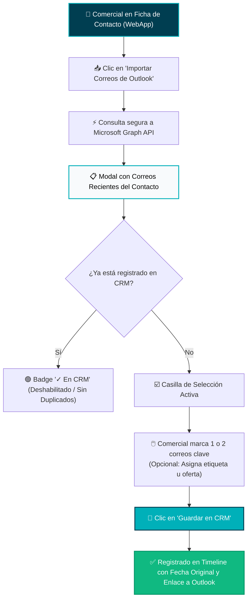
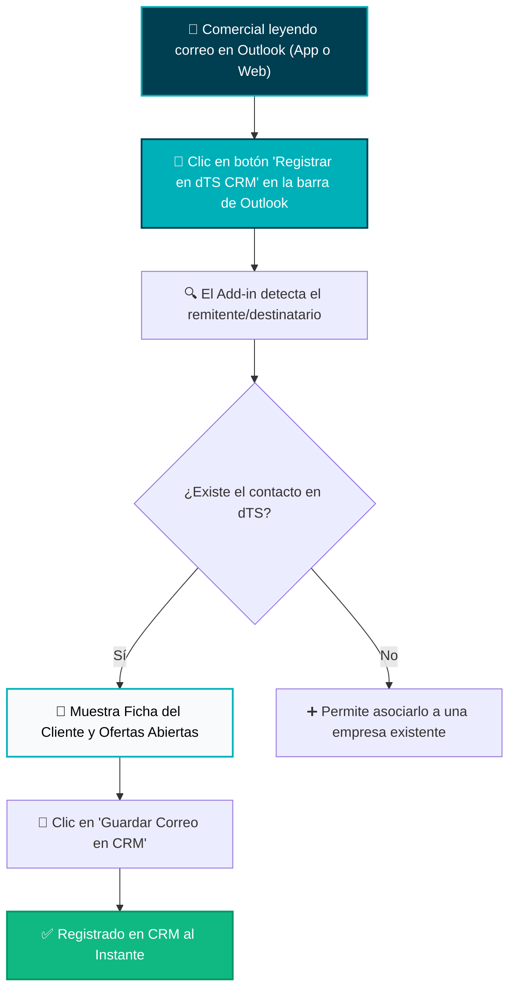
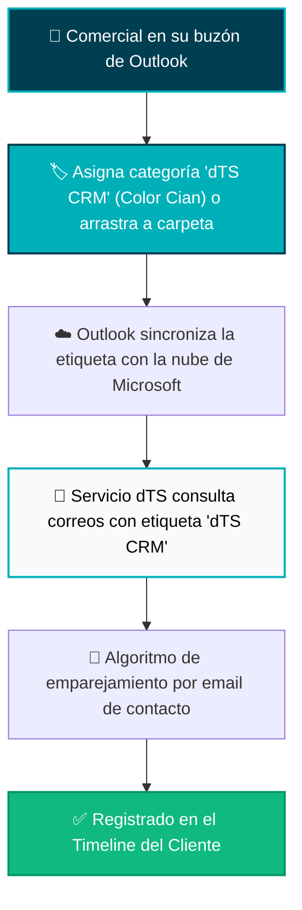
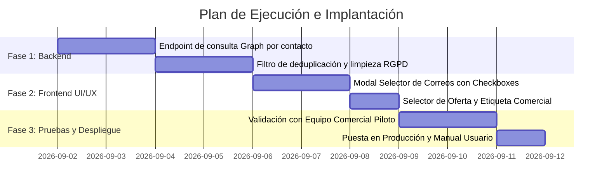

# 📊 Propuesta Ejecutiva para Dirección: Integración y Registro Selectivo de Correos de Outlook en dTS CRM

**Documento para Presentación a Dirección y Comité Comercial**  
*Fecha: 1 de Septiembre de 2026*  
*Proyecto: dTS Instruments WebApp & CRM Comercial*  
*Versión: 1.0 — Propuesta Técnica y Operativa*

---

## 1. 📌 Resumen Ejecutivo y Diagnóstico

### El Desafío Actual: "Ruido" vs. "Relevancia Comercial"
En la operativa diaria de **dTS Instruments**, los comerciales intercambian decenas de correos electrónicos con cada cliente y contacto. 

Una sincronización automática masiva e indiscriminada de la bandeja de entrada hacia el CRM genera dos problemas graves:
1. **Sobrecarga de Información y Pérdida de Enfoque**: El historial del contacto se satura de correos menores (*"gracias"*, *"recibido"*, confirmaciones de calendario, firmas automáticas de ausencia o correos internos), dificultando encontrar los hitos clave.
2. **Privacidad y Control Comercial**: Existen comunicaciones confidenciales, notas internas o borradores que no deben registrarse en la ficha general de la empresa.

### El Objetivo Estratégico
Implementar un mecanismo **manual, rápido y selectivo** donde el comercial o administrativo decida con **un solo clic** qué correos relevantes incorporar al historial del CRM (*Aceptaciones de ofertas, especificaciones técnicas de proyectos, acuerdos de precios o reclamaciones*), preservando la fecha original y el enlace directo a Microsoft Outlook.

---

## 2. 🔍 Análisis Comparativo de las 3 Opciones

A continuación se detallan las tres alternativas tecnológicas evaluadas, incluyendo su procedimiento paso a paso mediante infografías de flujo, sus puntos fuertes y sus inconvenientes.

---

### 🟢 Opción 1: Selector y Explorador de Correos In-App (Dentro de la WebApp)

> **Concepto:** El comercial accede a la ficha del contacto en el CRM y pulsa un botón que consulta a Microsoft Graph los correos recientes intercambiados con ese contacto. Se muestra una ventana con la lista de emails donde el comercial marca las casillas de los correos que desea registrar y pulsa *"Importar al CRM"*.

#### 🗺️ Infografía de Procedimiento (Opción 1):

#### ✅ Ventajas:
* **Cero Instalaciones Locales**: No requiere instalar complementos ni extensiones en los ordenadores de los comerciales. Funciona en Windows, Mac, iPad o navegador web.
* **Prevención Total de Duplicados**: La WebApp detecta qué correos ya están en el CRM y los muestra deshabilitados con el badge `✓ Registrado`.
* **Contexto Completo**: El comercial hace la importación en el mismo momento en que está consultando las ofertas, tareas o datos del contacto.
* **Previsualización Rápida**: Permite leer un extracto del cuerpo del mensaje antes de decidir si se importa.

#### ❌ Desventajas:
* Requiere que el comercial entre a la ficha del contacto en la WebApp para hacer la selección (no se hace directamente mientras lee el correo en la ventana de Outlook).

---

### 🔵 Opción 2: Complemento Oficial de Outlook (Add-in dTS CRM para Microsoft 365)

> **Concepto:** Se añade un botón oficial `"Registrar en dTS CRM"` dentro de la cinta de opciones de Microsoft Outlook (Escritorio y Web). Mientras el comercial lee o redacta un correo, pulsa el botón lateral y el mensaje se envía directamente a la base de datos de dTS.

#### 🗺️ Infografía de Procedimiento (Opción 2):

#### ✅ Ventajas:
* **Flujo Natural en Outlook**: El comercial registra el correo en caliente, en el mismo segundo en que lo lee en Outlook.
* **Asociación Flexible**: Permite vincular correos que proceden de remitentes no registrados a empresas existentes en el CRM.

#### ❌ Desventajas:
* **Fricción de Despliegue**: Requiere desplegar y mantener el manifiesto XML del Add-in en el Centro de Administración de Microsoft 365 de la empresa.
* **Curva de Aprendizaje**: Los comerciales deben acostumbrarse a abrir el panel lateral del complemento en Outlook.

---

### 🟣 Opción 3: Registro por Categorías de Color o Carpetas de Outlook

> **Concepto:** El comercial simplemente marca el correo en Outlook con la categoría de color `"dTS CRM"` o lo arrastra a una carpeta llamada `"dTS CRM"`. Un proceso en segundo plano de la WebApp lee periódicamente solo los correos con esa categoría y los guarda en el CRM.

#### 🗺️ Infografía de Procedimiento (Opción 3):

#### ✅ Ventajas:
* **Velocidad Extrema para el Comercial**: Asignar una categoría o presionar un atajo de teclado en Outlook lleva menos de 1 segundo.
* **Sin Ventanas Adicionales**: No abre modales ni requiere salir de Outlook.

#### ❌ Desventajas:
* **Falta de Feedback Inmediato**: El comercial no sabe si el correo se guardó al instante o si hubo un fallo hasta que entra a la WebApp.
* **Menor Control de Metadatos**: No permite clasificar el tipo de correo ni vincularlo a una oferta específica en el momento de asignarle la categoría.

---

## 3. ⚖️ Matriz Comparativa para Dirección

| Criterio de Evaluación | Opción 1: Selector In-App (WebApp) | Opción 2: Add-in de Outlook | Opción 3: Categoría en Outlook |
| :--- | :---: | :---: | :---: |
| **Facilidad para el Comercial** | ⭐⭐⭐⭐⭐ (Muy intuitivo, visual) | ⭐⭐⭐⭐ (Requiere panel lateral) | ⭐⭐⭐⭐⭐ (1 clic / atajo) |
| **Velocidad de Implantación** | 🚀 **Inmediata (1-2 días)** | ⏳ Media (1-2 semanas) | ⏳ Media (3-5 días) |
| **Mantenimiento Técnico** | 🟢 Muy bajo (Integrado en app) | 🟡 Medio (Manifiesto M365) | 🟡 Medio (Polling de categorías) |
| **Prevención de Duplicados** | 🛡️ **100% Garantizada** | 🛡️ Alta | ⚠️ Media |
| **Vinculación con Ofertas CRM** | ✅ **Directa y asistida** | ✅ Sí (mediante panel) | ❌ No (automática general) |
| **Limpieza de Firmas / RGPD** | ✅ **Automática en backend** | ✅ En el panel | ✅ En backend |
| **Coste / Requisitos TI** | 💶 **0 € (Sin costes extra)** | 💶 0 € (Requiere admin M365) | 💶 0 € |

---

## 4. 🏆 Recomendación Estratégica: ¿Cuál elegir?

### 🎯 Selección Recomendada: **OPCIÓN 1 (Selector In-App en la WebApp)**

#### Razón Principal: **Sencillez, Inmediatez y Cero Fricción Operativa**
1. **La más limpia y rápida para los comerciales**: Cuando el comercial está en la ficha del contacto revisando el cliente, pulsa `"Importar Correos de Outlook"`, ve en 2 segundos los últimos emails que ha cruzado con él, marca los 2 que importan (*"Aceptación de oferta"* y *"Dudas técnicas"*) y quedan guardados con su fecha original y enlace a Outlook.
2. **Cero despliegue en ordenadores**: No requiere que el departamento de informática instale nada en los portátiles de los comerciales ni configure políticas en Microsoft 365.
3. **No satura el CRM**: Solo entra la información que el comercial valida conscientemente.

---

## 5. 🚀 Mejoras de Alto Valor Añadido Incluidas en la Propuesta

Para que la herramienta sea una ventaja competitiva para el equipo comercial, se incorporan las siguientes mejoras:

### A. 🎯 Vinculación Automática a Ofertas del Pipeline
* Al seleccionar los correos para importar, el sistema muestra un desplegable con las **ofertas abiertas del contacto** (ej. *OF-2026-089: Reactor 50L*).
* Al vincularlo, el correo queda visible tanto en la ficha del contacto como en el historial específico de esa oferta comercial.

### B. 🏷️ Etiquetado Rápido por Tipología
* Permite asignar con un clic la tipología del mensaje:
  * `📄 Aceptación / Cierre`: Ofertas aceptadas o confirmaciones de pedido.
  * `⚙️ Especificación Técnica`: Requisitos técnicos del cliente.
  * `💬 Negociación / Precio`: Conversaciones sobre tarifas o condiciones.
  * `⚠️ Incidencia / Postventa`: Seguimiento de reclamaciones o entregas.

### C. 🧹 Limpieza Inteligente de Firmas y Avisos Legales
* El procesador de texto elimina automáticamente cláusulas legales de privacidad (RGPD), cadenas infinitas de `"De: ... Enviado el: ..."` y firmas con imágenes pesadas, guardando un texto limpio, legible y rápido de consultar.

### D. 🔗 Botón "Abrir en Outlook" Conservado
* Todo correo importado conserva su identificador único de Microsoft Graph, por lo que cualquier miembro autorizado del equipo puede pulsar **"Abrir en Outlook"** en el CRM y ver el correo completo en su formato original en Microsoft 365.

---

## 6. 📅 Plan de Implantación Propuesto

---

*Documentación elaborada para dTS Instruments.*  
*Para cualquier duda o ajuste sobre esta propuesta, consultar con el equipo de desarrollo.*
