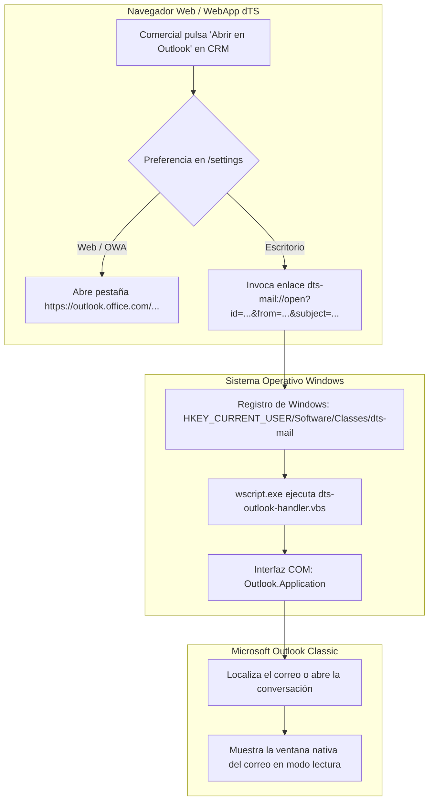
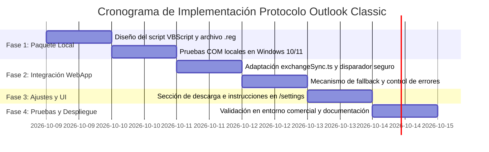

# 🚀 Plan de Implementación: Integración Nativa con Outlook Classic mediante Protocolo Windows (`.reg`)

**Documento:** Plan de Implementación Técnica y Opciones de Mejora  
**Fecha:** 8 de octubre de 2026  
**Destinatario:** Dirección General / Dirección Técnica y Comercial  
**Autor:** Equipo de Desarrollo dTS Instruments WebApp  
**Módulos Afectados:** CRM Contactos (`/crm/contacts/:id`), Ajustes Generales (`/settings`), Módulo Frontend de Integración Exchange/Outlook.

---

## 1. Resumen Ejecutivo y Objetivo

El objetivo de este plan es dotar a la WebApp de la capacidad de **abrir correos guardados directamente en la aplicación de escritorio Microsoft Outlook Classic (`OUTLOOK.EXE`) en modo lectura**, superando las restricciones del navegador mediante un protocolo URI personalizado de Windows (`dts-mail://`).

### Principios Fundamentales:
1. **Convivencia 100% transparente:** Los usuarios que elijan *Outlook Web (Navegador)* siguen abriendo sus correos en Microsoft 365 sin tocar nada de sus PCs. Los que elijan *Outlook Classic* disfrutan de apertura nativa en escritorio.
2. **Cero privilegios de administrador:** El archivo de registro actúa sobre `HKEY_CURRENT_USER`, lo que permite que cualquier comercial lo active sin requerir permisos elevados de Windows.
3. **Cero coste y cero descargas en disco:** No se descargan archivos temporales `.eml` en la carpeta de descargas ni se consume almacenamiento en servidores o bases de datos.

---

## 2. Arquitectura de la Solución



---

## 3. Componentes Técnicos a Desarrollar

### 3.1. Paquete Local de Windows (Instalador de 1 Clic)

El instalador se compone de dos archivos ligeros (ocupan menos de 5 KB en total):

1. **`configurar_outlook_dts.reg` (Registro de Windows):**
   Registra el protocolo `dts-mail://` a nivel de usuario actual:
   ```reg
   Windows Registry Editor Version 5.00

   [HKEY_CURRENT_USER\Software\Classes\dts-mail]
   @="URL:dTS Instruments Mail Protocol"
   "URL Protocol"=""

   [HKEY_CURRENT_USER\Software\Classes\dts-mail\shell]

   [HKEY_CURRENT_USER\Software\Classes\dts-mail\shell\open]

   [HKEY_CURRENT_USER\Software\Classes\dts-mail\shell\open\command]
   @="wscript.exe \"%LOCALAPPDATA%\\dTS\\outlook_handler.vbs\" \"%1\""
   ```

2. **`outlook_handler.vbs` (Manejador VBScript Invisible):**
   * Se aloja en `%LOCALAPPDATA%\dTS\outlook_handler.vbs` (ruta estándar de Windows para aplicaciones de usuario sin requerir administrador).
   * Se ejecuta mediante `wscript.exe` (ejecución 100% invisible, sin ventanas de consola negra que parpadeen).
   * Se conecta al proceso activo de Outlook mediante COM (`Outlook.Application`).
   * Parsea los parámetros de la URL (`id`, `subject`, `from`).
   * Si Outlook está cerrado, lo inicia en segundo plano y muestra el mensaje.
   * Si el mensaje se localiza por identificador o por búsqueda de asunto/remitente, ejecuta `.Display()` mostrando la ventana nativa.

3. **`instalar_dts_mail.bat` (Instalador automático en 1 solo clic):**
   * Script por lotes que crea la carpeta `%LOCALAPPDATA%\dTS`, copia el archivo `.vbs` y aplica el archivo `.reg` en silencio (`reg import ...`).
   * El comercial solo tiene que hacer doble clic en el instalador descargado.

---

### 3.2. Adaptación en el Frontend de la WebApp

1. **Servicio de Enlace (`exchangeSync.ts`):**
   * Modificar `openExistingEmailInOutlook(mail, target)`:
     * Si `target === 'web'`: mantiene la llamada a `webLink` o deeplink canónico.
     * Si `target === 'desktop'`: construye la URI:
       ```typescript
       const protocolUri = `dts-mail://open?id=${encodeURIComponent(mail.itemId || '')}&subject=${encodeURIComponent(mail.subject || '')}&from=${encodeURIComponent(mail.senderEmail || '')}`;
       triggerMailtoUri(protocolUri); // Reutiliza el disparador seguro de protocolo de navegador
       ```

2. **Ajustes Generales (`/settings`):**
   * En la sección de configuración de Outlook:
     * Al seleccionar *"Outlook de Escritorio (Classic)"*, se muestra un banner informativo con un botón directo:
       * **"📥 Descargar Configurador de Outlook Classic (Windows)"**
     * Instrucciones claras en 2 pasos visuales:
       1. Haz clic en descargar y abre el archivo.
       2. La primera vez que abras un correo en el CRM, marca *"Permitir siempre"* en la ventana de confirmación del navegador.

---

## 4. Opciones y Mejoras de Funcionalidad para Decisión

Para enriquecer la experiencia de usuario y facilitar la adopción, se plantean las siguientes **6 mejoras opcionales**:

---

### 💡 Mejora A: Descarga Asistida del Instalador desde la Propia WebApp (Recomendada)
* **Descripción:** Un endpoint o descarga directa en el frontend que genera un archivo `Configurar_Outlook_dTS.zip` o instalador `.bat`.
* **Ventaja:** El comercial no tiene que esperar a que el departamento de TI le configure nada; puede pulsar *"Configurar mi Outlook"* desde sus Ajustes y activarlo en 10 segundos.
* **Impacto:** Bajo esfuerzo de desarrollo, altísimo impacto en autonomía.

---

### 💡 Mejora B: Detección de Protocolo con Fallback Inteligente (Recomendada)
* **Descripción:** Si un comercial tiene configurado "Outlook Classic" pero pulsa el botón en un ordenador nuevo donde aún no ha ejecutado el `.reg`:
  * El navegador no reconocerá el protocolo `dts-mail://`.
  * La WebApp detecta que el navegador no perdió el foco (técnica estándar de *protocol-check* con temporizador de 1,5 segundos).
  * En lugar de no hacer nada, la WebApp muestra un modal elegante:
    > *"¿No se abrió Outlook Classic? Parece que este equipo aún no tiene configurado el enlace directo. ¿Deseas abrir el correo en Outlook Web o descargar el configurador rápido?"*
* **Ventaja:** Evita frustración al usuario si olvida instalar el archivo en un segundo portátil.

---

### 💡 Mejora C: Menú de Acciones Secundarias en la Tarjeta de Correo
* **Descripción:** En cada correo del CRM, el botón principal respeta la preferencia del usuario, pero se añade un botón secundario o menú desplegable de 3 puntos (`...`):
  * **"Abrir en Outlook Classic"** (o en Web según el caso inverso).
  * **"Buscar conversación completa en Outlook"** (lanza la búsqueda de todo el hilo con ese contacto).
  * **"Copiar asunto y remitente al portapapeles"**.
* **Ventaja:** Flexibilidad total para aquellos comerciales avanzados que a veces quieren abrir el correo puntual y otras veces quieren revisar todo el hilo histórico.

---

### 💡 Mejora D: Apertura Directa en Modo "Responder" (`dts-mail://reply?...`)
* **Descripción:** En la tarjeta de correo, añadir una acción rápida *"Responder en Outlook"*:
  * Llama a `dts-mail://reply?id=...`.
  * El script VBScript ejecuta `.ReplyAll().Display()`.
  * Outlook se abre directamente con la ventana de redacción, citando el correo original, con todos los destinatarios en copia y la firma corporativa de Outlook ya insertada.
* **Ventaja:** Ahorra al comercial el paso de abrir el correo y luego pulsar "Responder".

---

### 💡 Mejora E: Soporte de Búsqueda de Hilos (`dts-mail://search?...`)
* **Descripción:** Si el correo es antiguo y no se encuentra por su ID exacto (por ejemplo, si fue movido de carpeta o archivado en un archivo local `.pst`), el script ejecuta una búsqueda de respaldo en Outlook por remitente y asunto (`Explorer.Search`).
* **Ventaja:** Garantiza que el comercial nunca se quede con una pantalla de error, incluso si movió el correo a una subcarpeta personal de su Outlook.

---

### 💡 Mejora F: Script de Desinstalación Limpia (`desinstalar_protocolo.reg`)
* **Descripción:** Proporcionar junto con la documentación un archivo de un solo clic que elimina la clave `HKEY_CURRENT_USER\Software\Classes\dts-mail` y borra la carpeta temporal.
* **Ventaja:** Tranquilidad para el departamento de TI ante auditorías de seguridad o renovaciones de equipos.

---

## 5. Matriz de Valoración de Mejoras

| Mejora | Valor Comercial | Complejidad Técnica | Recomendación |
| :--- | :---: | :---: | :---: |
| **A: Descarga asistida en Ajustes** | ⭐⭐⭐⭐⭐ (Muy Alta) | Baja | **Incluir en Fase 1** |
| **B: Detección y Fallback inteligente** | ⭐⭐⭐⭐⭐ (Muy Alta) | Media | **Incluir en Fase 1** |
| **C: Menú de acciones secundarias** | ⭐⭐⭐⭐ (Alta) | Baja | **Incluir en Fase 2** |
| **D: Acción rápida 'Responder'** | ⭐⭐⭐⭐ (Alta) | Media | **Opcional según Dirección** |
| **E: Búsqueda de respaldo si no hay ID** | ⭐⭐⭐⭐⭐ (Muy Alta) | Media | **Incluir en Fase 1** |
| **F: Script de desinstalación** | ⭐⭐⭐ (Media) | Muy Baja | **Incluir en Fase 1** |

---

## 6. Plan de Trabajo por Fases y Estimación



### Fase 1: Preparación del Paquete Local Windows
* Redacción y prueba del script VBScript (`outlook_handler.vbs`) con soporte para búsqueda por ID y respaldo por remitente/asunto.
* Creación del instalador `.bat` y `.reg` para `HKEY_CURRENT_USER`.
* Verificación en Windows 10 y Windows 11 con Microsoft 365 Apps for Enterprise.

### Fase 2: Integración en Frontend
* Implementación de la construcción de URL de protocolo en `frontend/src/api/exchangeSync.ts`.
* Implementación de la detección de ejecución con fallback en caso de protocolo no registrado.

### Fase 3: Ajustes Generales y Experiencia de Usuario
* Actualización de la interfaz en `frontend/src/pages/settings/index.tsx` para ofrecer la descarga directa del paquete.
* Diseño del modal informativo de instalación.

### Fase 4: Verificación, Pruebas y Aprobación
* Pruebas de compilación limpia (`tsc -b && vite build` y backend `nest build`).
* Verificación de ambos escenarios: usuario con preferencia Web vs usuario con preferencia Classic.
* Aprobación del usuario antes de cualquier despliegue.

---

## 7. Próximos Pasos para la Reunión con Dirección

1. **Presentar las dos decisiones básicas:**
   * ¿Aprobamos la solución del protocolo `dts-mail://` mediante el archivo `.reg` local para los usuarios de Outlook Classic?
   * ¿Deseamos que el paquete incluya la descarga automática desde la propia WebApp (Mejora A) y el fallback inteligente (Mejora B)?
2. **Una vez aprobado:** Proceder a la implementación técnica sin impacto en los usuarios actuales de Outlook Web.
