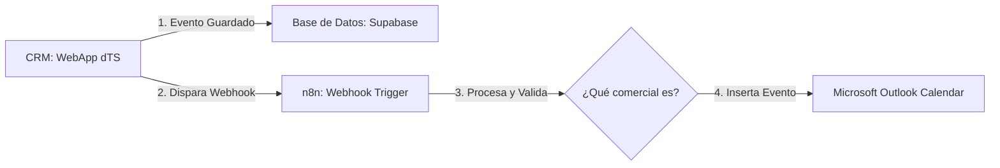

# Plan de Integración: Sincronización de Calendario Outlook con CRM (vía n8n)

Este documento sirve como recordatorio y guía de diseño para la futura implementación de la sincronización automática de eventos desde el CRM (WebApp dTS) hacia el calendario de Outlook utilizando la infraestructura existente de **n8n**.

---

## 1. Arquitectura del Flujo

La sincronización se realizará en segundo plano de manera desacoplada:

1. **CRM (Frontend/Backend):** Al guardar un evento en el CRM, el backend (NestJS) notifica a **n8n** enviando un JSON con los datos del evento y el correo del comercial responsable.
2. **n8n:** Recibe el webhook, procesa la información y utiliza el nodo oficial de Outlook para crear/actualizar el evento en el calendario correspondiente.

---

## 2. Estrategia de Configuración para 4 Cuentas de Correo

Dependiendo del entorno de las cuentas de correo, implementaremos una de estas dos estrategias en n8n:

### Opción A: Cuentas Corporativas (Mismo Dominio Microsoft 365) - *Recomendado*
* **Configuración:** Registro de una única Aplicación en Azure/Entra ID con permisos de aplicación (`Calendars.ReadWrite` a nivel de Tenant).
* **Flujo en n8n:** Una sola credencial en n8n. El nodo de Outlook recibe dinámicamente el correo del usuario (`comercial@empresa.com`) y escribe en su calendario correspondiente.
* **Ventaja:** Escalable de forma ilimitada sin modificar el flujo de n8n si se añaden más correos en el futuro.

### Opción B: Cuentas Independientes (Personales o Multidominio)
* **Configuración:** Autenticar individualmente 4 cuentas distintas en n8n, generando 4 credenciales independientes.
* **Flujo en n8n:** Uso de un nodo `Switch` (Router) en n8n para desviar el flujo al nodo de Outlook correspondiente con su respectiva credencial según el creador del evento.
* **Ventaja:** Funciona con cuentas hotmail/outlook independientes o de clientes distintos.

---

## 3. Tareas Pendientes (TODO)

### En el CRM (WebApp dTS)
- [ ] Modificar el endpoint/servicio de eventos en NestJS para que dispare una petición HTTP POST (Webhook) hacia n8n tras guardar un evento con éxito en Supabase.
- [ ] Incluir en el payload del Webhook:
  - ID del evento.
  - Correo electrónico del creador/comercial.
  - Título, descripción, fecha/hora de inicio y fin (en formato UTC/ISO 8601) y correos de los asistentes.

### En n8n
- [ ] Crear el workflow `[CRM] Sincronización Calendario Outlook`.
- [ ] Configurar el nodo de entrada `Webhook` para recibir los datos del CRM.
- [ ] Configurar la autenticación de Microsoft Outlook (vía Azure AD o credenciales individuales).
- [ ] Diseñar la lógica de mapeo de campos y formateo de fechas.
- [ ] Probar el flujo de creación, modificación y eliminación (usando el ID del evento del CRM para mantenerlos sincronizados).
